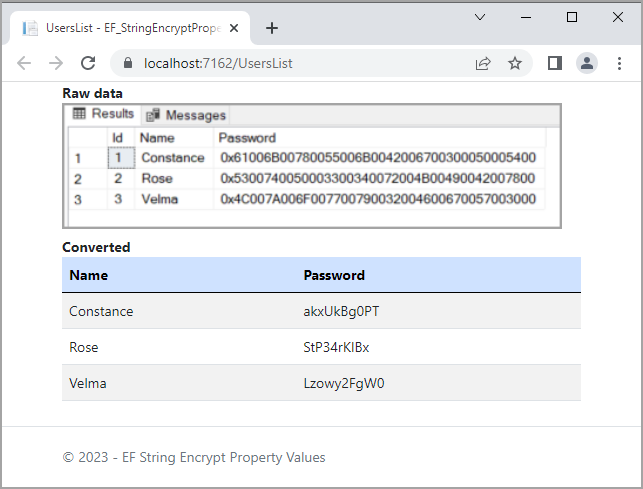

# EF Core 7 encrypt/decrypt string 

Provides a simple example for `encrypt/decrypt string` in a SQL-Server database table.

:pushpin:  See [documentation](EF_StringEncryptPropertyValues/readme.md)

